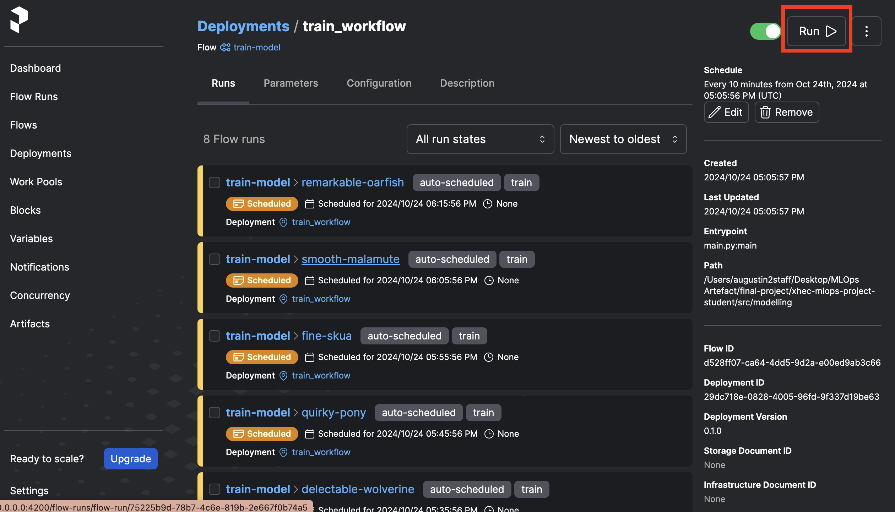

<div align="center">

# xhec-mlops-project-student

[]()
[](https://github.com/psf/black)

[](https://pycqa.github.io/isort/)
[](https://github.com/astral-sh/ruff)
[](https://github.com/artefactory/xhec-mlops-project-student/blob/main/.pre-commit-config.yaml)
</div>

This repository has for purpose to industrialize the [Abalone age prediction](https://www.kaggle.com/datasets/rodolfomendes/abalone-dataset) Kaggle contest.

<details>
<summary>Details on the Abalone Dataset</summary>

The age of abalone is determined by cutting the shell through the cone, staining it, and counting the number of rings through a microscope -- a boring and time-consuming task. Other measurements, which are easier to obtain, are used to predict the age.

**Goal**: predict the age of abalone (column "Rings") from physical measurements ("Shell weight", "Diameter", etc...)

You can download the dataset on the [Kaggle page](https://www.kaggle.com/datasets/rodolfomendes/abalone-dataset)

</details>

## Table of Contents

- [xhec-mlops-project-student](#xhec-mlops-project-student)
  - [Table of Contents](#table-of-contents)
  - [Deliverables and Evaluation](#deliverables-and-evaluation)
    - [Deliverables](#deliverables)
    - [Evaluation](#evaluation)
  - [Steps to reproduce to build the deliverable](#steps-to-reproduce-to-build-the-deliverable)
    - [Pull requests in this project](#pull-requests-in-this-project)
    - [Tips to work on this project](#tips-to-work-on-this-project)
  - [How to use our project](#How-to-use-our-project)
    - [0. Environment Setup](#0-environment-setup)
    - [1. EDA and Modelling](#1-eda-and-modelling)
    - [2. Visualize deployment to retrain the model in Prefect](#2-visualize-deployment-to-retrain-the-model-in-prefect)

## Deliverables and notation

### Deliverables

The deliverable of this project is a copy of this repository with the industrialization of the Abalone age prediction model. We expect to see:

1. a workflow to train a model using Prefect
- The workflows to train the model and to make the inference (prediction of the age of abalone) are in separate modules and use Prefect `flow` and `task` objects
- The code to get the trained model and encoder is in a separate module and must be reproducible (not necessarily in a docker container)
2. a Prefect deployment to retrain the model regularly
3. an API that runs on a local app and that allows users to make predictions on new data
  - A working API which can be used to make predictions on new data
    - The API can run on a docker container
    - The API has validation on input data (use Pydantic)

### Evaluation

Each of your pull requests will be graded based on the following criteria:

- **Clarity** and quality of code
  - good module structure
  - naming conventions
  - use of docstrings and type hinting
- **Formatting**
  - respect of clear code conventions

  *P.S. you can use a linter and automatic code formatters to help you with that*

- Proper **Functioning** of the code
  - the code must run without bugs

Bseides the evaluation of the pull requests, we will also evaluate:
- **Reproducibility** and clarity of instructions to run the code (we will actually try to run your code)
  - Having a clear README.md with
    - the context of the project
    - the name of the participants and their github users
    - the steps to recreate the Python environment
    - the instructions to run all parts of the code
- Use of *Pull Requests* (see below) to coordinate your collaboration

## Steps to reproduce to build the deliverable

To help you with the structure and order of steps to perform in this project, we created different pull requests templates.
Each branch in this repository corresponds to a future pull request and has an attached markdown file with the instructions to perform the tasks of the pull request.
Each branch starts with a number.
You can follow the order of the branches to build your project and collaborate.

> [!NOTE]
> There are "TODO" in the code of the different branches. Each "TODO" corresponds to a task to perform to build the project.
> [!IMPORTANT]
> Remember to remove all code that is not used before the end of the project (including all TODO tags in the code).

**Please follow these steps**:

- If not done already, create a GitHub account
- If not done already, create a [Kaggle account](https://www.kaggle.com/account/login?phase=startRegisterTab&returnUrl=%2F) (so you can download the dataset)
- Fork this repository (one person per group)

**WARNING**: make sure to **unselect** the option "Copy the `master` branch only", so you have all the branches in the forked repository.

- Add the different members of your group as admin to your forked repository
- Follow the order of the numbered branches and for each branch:
  - Read the PR_i.md (where i is the number of the branch) file to understand the task to perform
   > [!NOTE]
   > Dont forget to integrate your work from past branches (except for when working on branch #1 obviously (!))
   > ```bash
   > git checkout branch_number_i
   > git pull origin master
   > # At this point, you might have a VIM window opening, you can close it using the command ":wq"
   > git push
   > ```
    - Read and **follow** all the instructions in the the PR instructions file
    - Do as many commits as necessary on the branch_number_i to perform the task indicated in the corresponding markdown file
    - Open **A SINGLE** pull request from this branch to the main branch of your forked repository
    - Once done, merge the pull request in the main branch of your forked repository

### Pull requests in this project

Github [Pull Requests](https://docs.github.com/articles/about-pull-requests) are a way to propose changes to a repository. They have for purpose to integrate the work of *feature branches* into the main branch of the repository, with a collaborative review process.

**PR tips:**

Make sure that you select your own repository when selecting the base repository:


It should rather look like this:


### Tips to work on this project

- Use a virtual environment to install the dependencies of the project (conda or virtualenv for instance)

- Once your virtual environment is activated, install pre-commit hooks to automatically format your code before each commit:

```bash
pip install pre-commit
pre-commit install
```

This will guarantee that your code is formatted correctly and of good quality before each commit.

- Use a `requirements.in` file to list the dependencies of your project. You can use the following command to generate a `requirements.txt` file from a `requirements.in` file:

```bash
pip-compile requirements.in
```

_______________
_______________
_______________
Welcome to our MLOps project!

# How to use our project
## 0. Environment Setup

1. Set-up environment with conda (recommended)
```bash
conda env create --file environment.yml
```

2. Activate the environment
```bash
conda activate mlops-project-group5
```
### If you ned to change version of a package due to conflict follow this step
1. change the version in the `requirements.in` file

2. Compile the requirements
```bash
./install.sh
```

3. Update your conda environment
```bash
conda env update --file environment.yml --prune
```

### If you ned to makes some changes on our code
You need to install the pre-commit hooks
```bash
pre-commit install
```

## 1. EDA and Modelling

### Running the modelling notebook and comparing experiments on mlflow

Run the whole [modelling](./notebooks/modelling.ipynb) notebook to create and save experiment using MLflow.

Be sure to be in the [notebooks](./notebooks) directory in your terminal. (Reminder: `cd notebooks`)

After having run the three experiments in the [modelling](./notebooks/modelling.ipynb) notebook, you can compare them using the mlflow UI by running the following line in the terminal:
```bash
mlflow ui --host 0.0.0.0 --port 5002
```

Then goes to http://localhost:5002

You should then arrive on this UI, on which you can compare the different experiments / models:


## 2. Visualize deployment to retrain the model in Prefect

Please follow these steps :

- Set an API URL for your local server to make sure that your workflow will be tracked by this specific instance :
```
prefect config set PREFECT_API_URL=http://0.0.0.0:4200/api
```

- Check you have SQLite installed ([Prefect backend database system](https://docs.prefect.io/2.13.7/getting-started/installation/#external-requirements)):
```
sqlite3 --version
```

- Start a local prefect server :
```
prefect server start --host 0.0.0.0
```

If you want to reset the database, run :
```
prefect server database reset
```


You can visit the UI at http://localhost:4200/dashboard


You can now run **in another terminal** the following command, at the root of the directory, to schedule regular model retraining:

*(Be sure to reactivate your `mlops-project-group5` environment)*
```
python3 src/modelling/deployment.py
```

When on http://localhost:4200/deployments, click on train-model to see the scheduled retraining of the model as illustrated hereunder:


You click on quick run to train the model now, then go at the bottom of the page and click on the latest run:


You should then be able to see the training flow and the different tasks within this flow:

