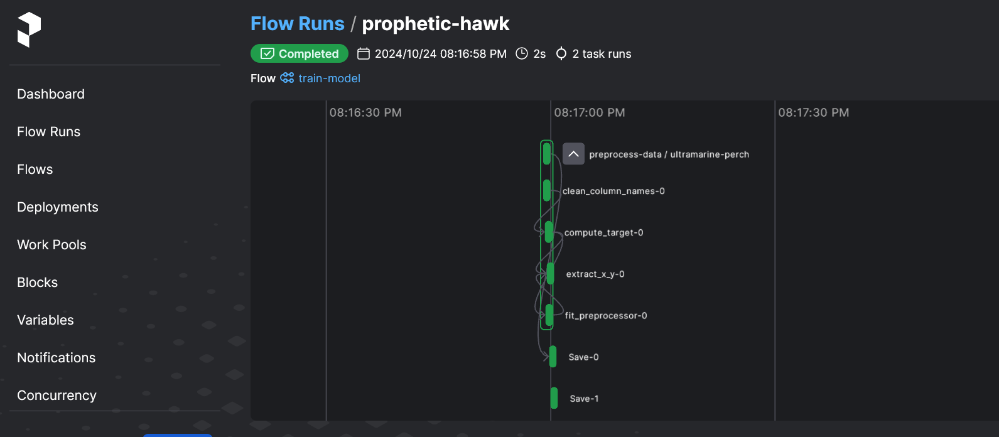
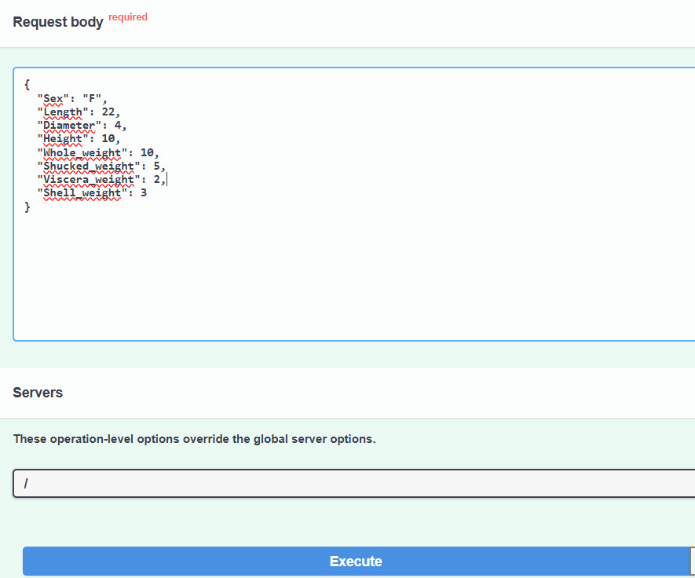
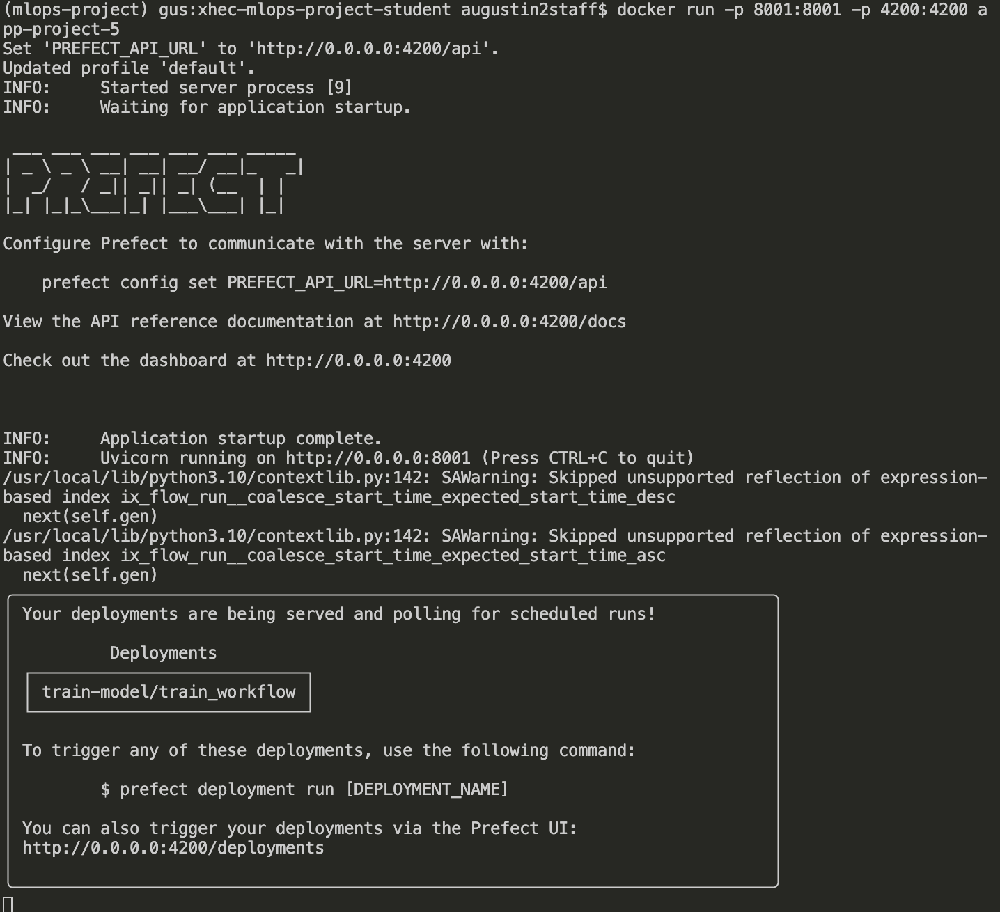

<div align="center">

# X-HEC MLOps Project

[]()
[](https://github.com/psf/black)

[](https://pycqa.github.io/isort/)
[](https://github.com/astral-sh/ruff)
[](https://github.com/artefactory/xhec-mlops-project-student/blob/main/.pre-commit-config.yaml)
</div>


## Table of Contents

  - [Table of Contents](#table-of-contents)
  - [Introduction](#introduction)
  - [How to use our project](#How-to-use-our-project)
    - [0. Environment Setup](#0-environment-setup)
    - [1. EDA, Modelling and experiments tracking with MLFLow](#1-eda-modelling-and-experiments-tracking-with-mlflow)
    - [2. Create orchestration pipeline and deploy it with Prefect](#2-create-orchestration-pipeline-and-deploy-it-with-prefect)
    - [3. Deploy trained model on API](#3-deploy-trained-model-on-api)
    - [4. Run the whole workflow on Docker](#4-run-the-whole-workflow-on-docker)


## Introduction
**Welcome to our MLOps project!**

This project has been created as part of an MLOps class.

It aims to demonstrate several tools used in MLOps: serialization of trainings with MLFlow, model deployment with Prefect, model prediction on API with FastAPI, and dockerization of the whole workflow.

For this project, we based ourselves the [Abalone age prediction](https://www.kaggle.com/datasets/rodolfomendes/abalone-dataset) Kaggle contest, where the goal is predict the age of an abalone from physical measurements. The dataset is included in the repository but you can download it on the [Kaggle page](https://www.kaggle.com/datasets/rodolfomendes/abalone-dataset) if needed.

Authors:
- Benjamin Cerf (@benjamincerf57)
- Matthieu Delsart (@matthieudelsart)
- François Lebrun (@FrancoisLbrn)
- Augustin de Saint-Affrique (@AdeStAff)


# How to use our project
## 0. Environment Setup

0. Clone the repository on your local machine
```bash
git clone https://github.com/matthieudelsart/xhec-mlops-project-student
```

1. Set up environment with conda (recommended)
```bash
conda env create --file environment.yml
```

2. Activate the environment
```bash
conda activate mlops-project
```
### If you ned to change version of a package due to conflict, follow these steps
1. Change the version in the `requirements.in` file

2. Compile the requirements
```bash
./install.sh
```

3. Update your conda environment
```bash
conda env update --file environment.yml --prune
```

### If you ned to makes some changes on our code
You need to install the pre-commit hooks
```bash
pre-commit install
```

## 1. EDA, Modelling and experiments tracking with MLFLow

Run the whole [modelling](./notebooks/modelling.ipynb) notebook to create and save experiments using MLflow.

Make sure to be in the [notebooks](./notebooks) directory in your terminal.

After running the three experiments in the [modelling](./notebooks/modelling.ipynb) notebook, you can compare them using the mlflow UI by running the following line in the terminal:

*(make sure to be in the [notebooks](./notebooks) directory in your terminal: `cd notebook`)*

```bash
mlflow ui --host 0.0.0.0 --port 5002
```

Then, go to http://localhost:5002

You should then arrive on this UI, on which you can compare the different experiments / models:


## 2. Create orchestration pipeline and deploy it with Prefect

Follow these steps :

- Set an API URL for your local server to make sure that your workflow will be tracked by this specific instance :
```
prefect config set PREFECT_API_URL=http://0.0.0.0:4200/api
```

> Note that Windows users may prefer to use `127.0.0.1` instead of `0.0.0.0` here and in other steps

- Check you have SQLite installed ([Prefect backend database system](https://docs.prefect.io/2.13.7/getting-started/installation/#external-requirements)):
```bash
sqlite3 --version
```

- Start a local prefect server :
```bash
prefect server start --host 0.0.0.0
```

If you want to reset the database, run :
```bash
prefect server database reset
```


You can visit the UI at http://localhost:4200/dashboard


- You can now run **in another terminal** the following command, at the root of the directory, to schedule regular model retraining:

  *(Be sure to reactivate your `mlops-project` environment)*
```
python3 src/modelling/deployment.py
```

- When on http://localhost:4200/deployments, click on train-model to see the scheduled retraining of the model:


- You can click on "quick run" to train the model now, then go at the bottom of the page and click on the latest run:


- You should then be able to see the training flow and the different tasks within this flow:



## 3. Deploy an API to predict new observations
Follow these steps:
- Go in the web_service folder:
```
cd src/web_service
```

- Run the app:
```
uvicorn main:app --reload
```
- Click on the link provided: http://127.0.0.1:8000/docs

- Click on Try it out:


- Fill here the data of your observation:


And then execute !

- Your prediction is given just below:


## 4. Run the whole workflow on Docker

#### Why use Docker?
Docker is used to containerize both the FastAPI application and Prefect server, ensuring consistent environments and easy deployment.

#### Prerequisites
Make sure you have Docker installed.

#### To do:

- Create the docker image:
Go in your terminal and run:
```
docker build -t project-app -f Dockerfile.app .
```

- Run it on a container:
```
docker run -p 8001:8001 -p 4200:4200 project-app
```

- Then you should see This in your terminal:


- Click on the links that are provided to you to run the API and use PREFECT from different ports.
Enjoy !
